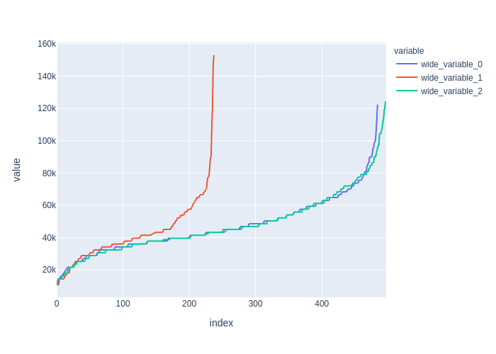
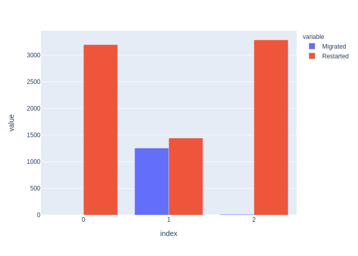

# CS776 - Programming Project
## Matthew Perry - UIN: 01038986

## Section 1 - Challenges and Tradeoffs

A miriad of issues and challenges presented themselves to me when creating and refining this project. I decided to complete it in C++ for two reasons. The first was that the professor stated that this was preferred, but the second was that I wanted an example of a substancial project for future interviews. Some of the subjects that I am going to touch on in this section are time management(both in and out of the program), changing the shifts(handling incoming and outgoing cars), networking, virtual machine migrating, and how many simultaneous jobs that the datacenter will run.

## 1.1 Time Management

Both real life time management and how to handle time in the program were challenges to the project. With coursework entirely online this semester, I've needed to be more self-driven than ever before to complete coursework on time. Back to the project, I had a choice between having the program run on real time and getting results that way, or simulating two weeks and allowing the program to run much faster. I decided that due to the time constraints of the project, it would be best to simulate the time so that I could have time to run and debug the program.

## 1.2 Shift Changes

Keeping track of the vehicles coming in and out, as well as which one's should be entering and leaving could have been a real headache. I eventually came to the conclusion to use the ID that I was assigning to them to keep track of who was part of which "shift". There were 24 shifts in total, seeing as a shift would change every hour. This would ensure that every vehicle would cycle at the same pace.

## 1.3 Networking

There were many, many iterations of the network that I just felt were not up to snuff for the project. I had to scrap this portion of the project several times and restart on it. Further, as an oversight, it seems that inter-vehicle communication does NOT require the receiving vehicle to have access to the Access Point when receiving migrations or uploads. Further, Vehicles downloading intermediate data from another vehicle does not require the vehicle it is downloading from to have access to bandwidth at all. Given more time, I would like to fix it, but as it stands, this is what I can do.

## 1.4 Migrating

While I first believed this to be an issue with only what I have been calling "Front Migration"(migrating as soon as possible), it seems that the migration issue stemmed much deeper than I thought in my implementation. It took hours, if not days, of debugging and hair pulling to finally get it to work in a reasonable fashion. Taking a step away from the project for a few days to clear my mind was likely the best decision I made when trying to resolve these issues.

## 1.5 Number of Simultaneous Jobs

This wasn't so much a challenge or tradeoff, than it was a design decision that I wanted to impart upon you. As it stands, the program takes two command line arguments: the number of weeks to run the simulation and the number of reducers to use for the reduce stage of a job. To ensure that there were unused vehicles to be able to migrate to, I decide that it would be best if we kept the datacenter at using 80% capacity, leaving the last 20% available for migrations. That being said, the number of reducers that you pass in is used to calculate how many concurrent jobs the datacenter is able to run. As an example, there are 256 jobs when 8 reducers are used.

## Section 2 - Graphical Data (Results)

And here we have the fruits of our labor. The graphs below are intended to show the difference between migration strategies: no migration, front-loaded migration, and back-loaded migration. I attempted to edit labels and such for these graphs, but ran out of time to do so.

To explain further on the above graph, the blue line is the completion time data for the run of the simulation without migrations. The red line shows the completion time data for the front-loaded migration policy, and finally the green line shows data for the back-loaded migration policy. Based upon the graph, it seems that no migration seems to be the best policy, resulting in a much lower completion time. This could be due to a lot of things, but the first thing that comes to mind is the network traffic. Since the Access Points were in use more, some jobs just couldn't get to upload or migrate before the vehicle left and the job needed to restart.

This bar chart shows us an interesting piece of data. From left to right, the groups are as follows: No Migration, Front-Loaded Migration, Back-Loaded Migration. What is interesting is that the set with the least restarts and the most migrations is the set that completed the least amount of jobs. The amount of jobs that it completed was nearly half of the other two. Back-Loaded Migration seemed to be unreliable, as well. It completed a measely 13 migrations in the two week period, and had even more restarts than the No Migration model, likely due to the congestion suggested when going over the first graph.